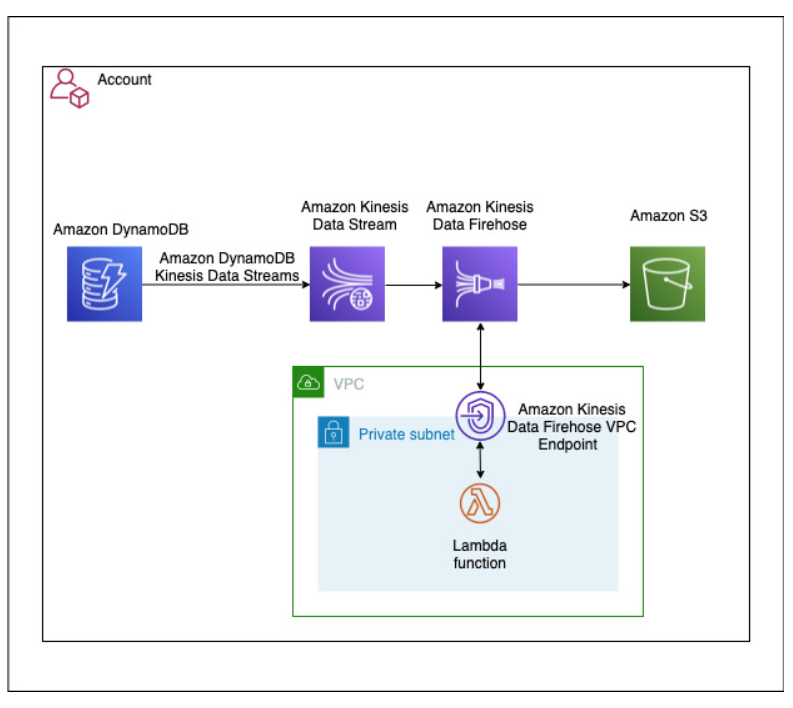
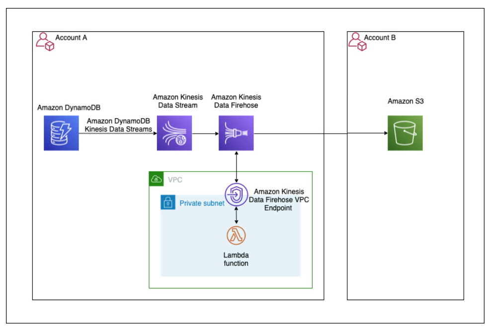

# Dynamo to Lake Streaming

## Use case 1: DynamoDB and Amazon S3 in same AWS account

In our first use case, our DynamoDB table and S3 bucket are in the same account. We have the following resources:

A Kinesis data stream is configured to use 10 shards, but you can change this as needed.
A DynamoDB table with Kinesis streaming enabled is a source to the Kinesis data stream, which is configured as a source to a Firehose delivery stream.

The Firehose delivery stream is configured to use a Lambda function for record transformation along with data delivery into an S3 bucket. The Firehose delivery stream is configured to batch records for 2 minutes or 1 MiB, whichever occurs first, before delivering the data to Amazon S3. The batch window is configurable for your use case. For more information, see Configure settings.

The Lambda function used for this solution transforms the DynamoDB item’s multi-level JSON structure to a single-level JSON structure. It’s configured to run in a private subnet of an Amazon VPC, with no internet access. You can extend the function to support more complex business transformations.

The following diagram illustrates the architecture of the solution.

The architecture uses the DynamoDB feature to capture item-level changes in DynamoDB tables using Kinesis Data Streams. This feature provides capabilities to securely stream incremental updates without any custom code or components.

## Prerequisites

To implement this architecture, you need the following:

An AWS account
Admin access to deploy the needed resources
Deploy the solution
In this step, we create a new Amazon VPC along with the rest of the components.

We also create an S3 bucket with the following features:

Encryption at rest using customer master keys (CMKs)
Block Public Access
Bucket versioning
You can extend the template to enable additional S3 bucket features as per your requirements.

For this post, we use an AWS CloudFormation template to deploy the resources. As part of best practices, consider organizing resources by lifecycle and ownership as needed.

We use an AWS Key Management Service (AWS KMS) key for server-side encryption to encrypt the data in Kinesis Data Streams, Kinesis Data Firehose, Amazon S3, and DynamoDB.

The Amazon CloudWatch log group data is always encrypted in CloudWatch Logs. If required, you can extend this stack to encrypt log groups using KMS CMKs.

Click on Launch Stack button below to create a CloudFormation :

https://console.aws.amazon.com/cloudformation/home?region=us-east-1#/stacks/new?stackName=bdb1040-ddb-lake-single-account-stack&templateURL=https://aws-bigdata-blog.s3.amazonaws.com/artifacts/bdb1040-blog-kds-deployment-artifacts/same-account/ddb-lake-single-account.yaml

On the CloudFormation console, accept default values for the parameters.

Select I acknowledge that AWS CloudFormation might create IAM resources with custom names.

Choose Create stack.

After stack creation is complete, note the value of the BucketName output variable from the stack’s Outputs tab. This is the S3 bucket name that is created as part of the stack. We use this value later to test the solution.

## Test the solution
To test the solution, we insert a new item and then update the item in the DynamoDB table using AWS CloudShell and the AWS Command Line Interface (AWS CLI). We will also use the AWS Management Console to monitor and verify the solution.

On the CloudShell console, verify that you’re in the same Region as the DynamoDB table (the default is us-east-1).
Enter the following AWS CLI command to insert an item:
aws dynamodb put-item \ 
--table-name blog-srsa-ddb-table \ 
--item '{ "id": {"S": "864732"}, "name": {"S": "Adam"} , "Designation": {"S": "Architect"} }' \ 
--return-consumed-capacity TOTAL
Enter the following command to update the item: We are updating the Designation from “Architect” to ” Senior Architect”
aws dynamodb put-item \ 
--table-name blog-srsa-ddb-table \ 
--item '{ "id": {"S": "864732"}, "name": {"S": "Adam"} , "Designation": {"S": "Senior Architect"} }' \ 
--return-consumed-capacity TOTAL
All item-level modifications from the DynamoDB table are sent to a Kinesis data stream (blog-srsa-ddb-table-data-stream), which delivers the data to a Firehose delivery stream (blog-srsa-ddb-table-delivery-stream).

You can monitor the processing of updated records in the Firehose delivery stream on the Monitoring tab of the delivery stream.

You can verify the delivery of the updates to the data lake by checking the objects in the S3 bucket (BucketName value from the stack Outputs tab).

The Firehose delivery stream is configured to write records to Amazon S3 using a custom prefix which is based on the date the records are delivered to the delivery stream. This partitions the delivered records by date which helps improve query performance by limiting the amount of data that query engines need to scan in order to return the results for a specific query. For more information, see Custom Prefixes for Amazon S3 Objects.

The file is in JSON format. You can verify the data in the following ways:

Download the files
Use AWS Glue by running a crawler to create a table that you can query using Amazon Athena
Use Amazon S3 Select to query the data

# DynamoDB and Amazon S3 in different AWS accounts

The solution for this use case uses two CloudFormation stacks: the producer stack (deployed in Account A) and the consumer stack (deployed in Account B).

The producer stack (Account A) deploys the following:

A Kinesis data stream is configured to use 10 shards, but you can change this as needed.

A DynamoDB table with Kinesis streaming is enabled as a source to the Kinesis data stream, and the data stream is configured as a source to a Firehose delivery stream.

The Firehose delivery stream is configured to use a Lambda function for record transformation along with data delivery into an S3 bucket in Account B. The delivery stream is configured to batch records for 2 minutes or 1 MiB, whichever occurs first, before delivering the data to Amazon S3. The batch window is configurable for your use case.

The Lambda function is configured to run in a private subnet of an Amazon VPC, with no internet access. For this solution, the function transforms the multi-level JSON structure to a single-level JSON structure. 

You can extend the function to support more complex business transformations.

The consumer stack (Account B) deploys an S3 bucket configured to receive the data from the Firehose delivery stream in Account A.

The following diagram illustrates the architecture of the solution.

The architecture uses the DynamoDB feature to capture item-level changes in DynamoDB tables using Kinesis Data Streams. This feature provides capabilities to securely stream incremental updates without any custom code or components. 

# Prerequisites
For this use case, you need the following:

Two AWS accounts (for the producer and consumer)
If you already deployed the architecture for the first use case and want to use the same account, delete the stack from the previous use case before proceeding with this section
Admin access to deploy needed resources

Deploy the components in Account B (consumer)
This step creates an S3 bucket with the following features:
Encryption at rest using CMKs
Block Public Access
Bucket versioning
You can extend the template to enable additional S3 bucket features as needed.

We deploy the resources with a CloudFormation template. As part of best practices, consider organizing resources by lifecycle and ownership as needed.

We use the KMS key for server-side encryption to encrypt the data in Amazon S3.

The CloudWatch log group data is always encrypted in CloudWatch Logs. If required, you can extend the stack to encrypt log group data using KMS CMKs.

Choose Launch Stack to create a CloudFormation stack in your account:

For DDBProducerAccountID, enter Account A’s account ID.
For KMSKeyAlias, the KMS key used for server-side encryption to encrypt the data in Amazon S3 is populated by default.

Choose Create stack.

After stack creation is complete, note the value of the BucketName output variable. We use this value later to test the solution.

Deploy the components in Account A (producer)

In this step, we sign in to the AWS Management Console with Account A to deploy the producer stack. We use the KMS key for server-side encryption to encrypt the data in Kinesis Data Streams, Kinesis Data Firehose, Amazon S3, and DynamoDB. As with other stacks, the CloudWatch log group data is always encrypted in CloudWatch Logs, but you can extend the stack to encrypt log group data using KMS CMKs.

Choose Launch Stack to create a CloudFormation stack in your account:

For ConsumerAccountID, enter the ID of Account B.

For CrossAccountDatalakeBucket, enter the bucket name for Account B, which you created in the previous step.

For ArtifactBucket, the S3 bucket containing the artifacts required for deployment is populated by default.
For KMSKeyAlias, the KMS key used for server-side encryption to encrypt the data in Amazon S3 is populated by default.

For BlogTransformationLambdaFile, the Amazon S3 key for the Lambda function code to perform Amazon Firehose Data transformation is populated by default.

Select I acknowledge that AWS CloudFormation might create IAM resources with custom names.
Choose Create stack.

# Test the solution

To test the solution, we sign in as Account A, insert a new item in the DynamoDB table, and then update that item. Make sure you’re in the same Region as your table.

On the CloudShell console, enter the following AWS CLI command to insert an item:
aws dynamodb put-item \ 
--table-name blog-srca-ddb-table \ 
--item '{ "id": {"S": "864732"}, "name": {"S": "Chris"} , "Designation": {"S": "Senior Consultant"} }' \ 
--return-consumed-capacity TOTAL
Update the existing item with the following code:
aws dynamodb put-item \ 
--table-name blog-srca-ddb-table \ 
--item '{ "id": {"S": "864732"}, "name": {"S": "Chris"} , "Designation": {"S": "Principal Consultant"} }' \ 
--return-consumed-capacity TOTAL
Sign out of Account A and sign in as Account B to verify the delivery of records into the data lake.
All item-level modifications from an DynamoDB table are sent to a Kinesis data stream (blog-srca-ddb-table-data-stream), which delivers the data to a Firehose delivery stream (blog-srca-ddb-table-delivery-stream) in Account A.

You can monitor the processing of the updated records on the Monitoring tab of the Firehose delivery stream.

You can verify the delivery of updates to the data lake by checking the objects in the S3 bucket that you created in Account B.

The Firehose delivery stream is configured similarly to the previous use case.

You can verify the data (in JSON format) in the same ways:

Download the files

Run an AWS Glue crawler to create a table to query in Athena
Query the data using Amazon S3 Select
Clean up

To avoid incurring future charges, clean up all the AWS resources that you created using AWS CloudFormation. You can delete these resources on the console or via the AWS CLI. For this post, we walk through the steps using the console.

# Clean up resources from use case 

To clean up the DynamoDB and Amazon S3 resources in different accounts, complete the following steps:

Sign in to Account A.
On the AWS CloudFormation console, delete the stack bdb1040-ddb-lake-multi-account-stack.
Sign in to Account B.
On the Amazon S3 console, empty the S3 bucket and remove any pervious versions of S3 objects.
On the AWS CloudFormation console, delete the stack bdb1040-ddb-lake-multi-account-stack.
Extend the solution
You can extend this solution to stream DynamoDB table data into cross-Region S3 buckets by setting up cross-Region replication (using the Amazon secured private channel) on the bucket where Kinesis Data Firehose delivers the data.

You can also perform a point-in-time initial load of the DynamoDB table into the data lake before setting up DynamoDB Kinesis streams. DynamoDB provides a no-coding required feature to achieve this. For more information, see Export Amazon DynamoDB Table Data to Your Data Lake in Amazon S3, No Code Writing Required.

To extend the usability scope of DynamoDB data in S3 buckets, you can crawl the location to create AWS Glue Data Catalog database tables. Registering the locations with AWS Lake Formation helps simplify permission management and allows you to implement fine-grained access control. You can also use Athena, Amazon Redshift, Amazon SageMaker, and Amazon QuickSight for data analysis, ML, and reporting services.